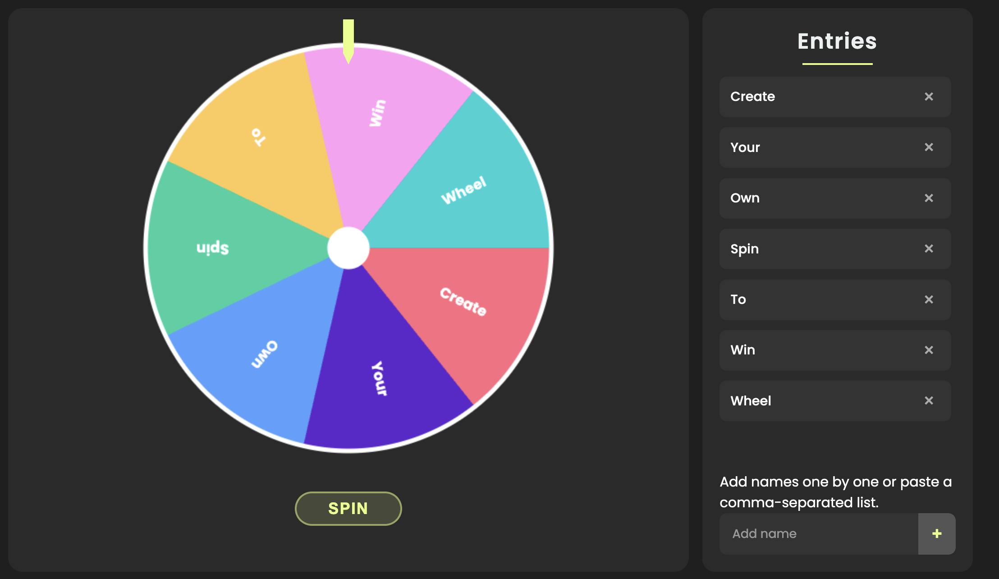

# Winner Wheel

A beautiful and interactive spinning wheel application for random selection, giveaways, and decision making.



## Features

- **Customizable Wheel**: Add as many entries as you need
- **Smooth Animation**: Enjoy fluid motion and professional transitions
- **Winner Announcement**: Clear visual and animated winner display
- **Bulk Entry Support**: Add multiple entries at once with comma separation
- **Mobile Responsive**: Works on phones, tablets, and desktop browsers
- **Color Customization**: Change wheel and text colors to your preference

## Usage

1. Visit [Winner Wheel](https://selectawinnerwheel.com)
2. Add entries individually or in bulk using the entry panel
3. Click the "SPIN" button to randomly select a winner
4. See the winner announcement and result display

## Installation

If you want to run this locally:

1. Clone the repository
```
```

2. Open `index.html` in your browser

That's it! No dependencies or installation required.

## Development

The application is built with vanilla JavaScript, HTML, and CSS.

### Project Structure

- `index.html` - Main HTML file
- `styles.css` - All styling and animations
- `script.js` - JavaScript functionality
- `images/` - Contains logo, favicon, and sharing images

## License

© 2025 Select a Winner Wheel. Built by Paul Crossland.

## Contact

For support or inquiries, please contact [hello@paulcrossland.com](mailto:hello@paulcrossland.com)
